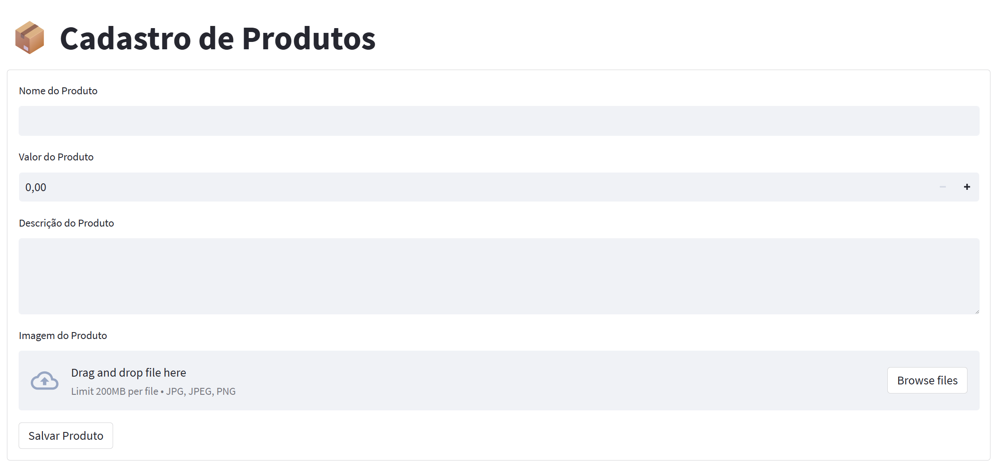
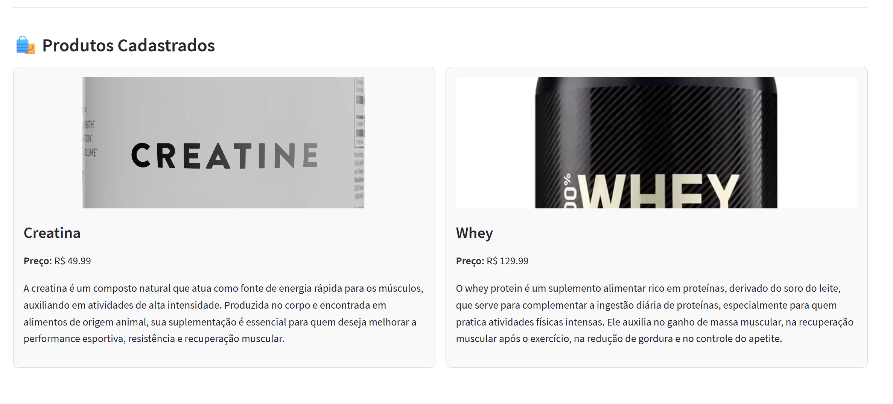

# 🛒 Aplicação de Cadastro e Gestão de Produtos

## 📌 Descrição

Este projeto demonstra uma **aplicação web** construída com **Streamlit** para o **cadastro e gerenciamento de produtos**, com integração direta a **serviços de nuvem (Azure)** para o armazenamento de imagens e persistência de dados. A solução utiliza:

- **Azure Blob Storage** para o upload e armazenamento de imagens de produtos, proporcionando uma solução escalável e segura para gerenciar grandes volumes de arquivos.
- **Azure SQL Database** (SQL Server) para o armazenamento e recuperação eficiente de dados estruturados, utilizando **pyodbc** para conectar e realizar operações de banco de dados em nuvem.
- **Variáveis de ambiente** gerenciadas com a biblioteca **dotenv**, garantindo a segurança de credenciais sensíveis e facilitando a configuração de ambientes de produção.

### Principais Tecnologias e Práticas:

- **Azure Blob Storage**: Configuração e integração para armazenar dados não estruturados (imagens), garantindo alta disponibilidade e segurança. O **Blob Storage** é utilizado aqui para facilitar o upload, armazenamento e a recuperação de imagens associadas aos produtos cadastrados.
  
- **SQL Server na Nuvem (Azure SQL Database)**: A aplicação utiliza o **Azure SQL Database** para armazenar dados estruturados de forma eficiente. A conexão com o banco é realizada através do **ODBC**, utilizando **pyodbc**, para garantir uma integração segura e confiável.
  
- **Streamlit**: Framework de desenvolvimento rápido para aplicações web interativas, utilizado para criar a interface de cadastro e visualização de produtos. O **Streamlit** permite a criação de interfaces simples, mas poderosas, sem necessidade de front-end complexo, tornando a aplicação rápida e fácil de desenvolver.

---

## ✨ Funcionalidades

- ✅ Cadastro de produtos com imagem
- ✅ Upload de imagens para Azure Blob Storage
- ✅ Armazenamento das informações em SQL Server (Azure)
- ✅ Interface interativa e responsiva com Streamlit
- ✅ Listagem visual de todos os produtos cadastrados

---

## 🖼️ Interface

  
   
  <em>Formulário para cadastro de produto</em>
    
  
   
  <em>Listagem visual dos produtos cadastrados</em>

---

## ⚙️ Tecnologias Utilizadas

- **Python**
- **Streamlit** – framework para criar a interface web
- **Azure Blob Storage** – armazenamento de imagens
- **Azure SQL Database (SQL Server)** – banco de dados
- **pyodbc** – conexão com o SQL Server
- **dotenv** – gerenciamento de variáveis de ambiente

---
## 🚀 Como Executar o Projeto
Clone o repositório:

git clone https://github.com/seu-usuario/seu-repositorio.git
cd seu-repositorio

Instale as dependências:

pip install -r requirements.txt

Configure as variáveis de ambiente:

Crie um arquivo .env na raiz do projeto com o seguinte conteúdo:

BLOB_CONNECTION_STRING=...

BLOB_CONTAINER_NAME=...

BLOB_ACCOUNT_NAME=...

SQL_SERVER=...

SQL_USER=...

SQL_DATABASE=...

SQL_PASSWORD=...

⚠️ Nunca suba esse arquivo para o GitHub – ele está ignorado no .gitignore.

Você pode usar o arquivo .env.example como referência.

Execute a aplicação:

streamlit run app.py

## 📁 Estrutura do Projeto
app.py – Código principal da aplicação

.env.example – Exemplo de variáveis de ambiente (sem dados sensíveis)

requirements.txt – Dependências do projeto

README.md – Documentação do projeto

images/ – Capturas de tela da aplicação

## 🔐 Segurança
O arquivo .env contém informações sensíveis e não deve ser versionado.

Utilize o .env.example para indicar as variáveis necessárias à equipe sem expor dados reais.

## 👨‍💻 Autor
Bruno

GitHub: https://github.com/BrunoOMelo

LinkedIn: https://www.linkedin.com/in/bruno-melo-bm

## 🛡️ Licença
Distribuído sob a licença MIT.
Você pode usar, modificar e redistribuir este projeto livremente.
